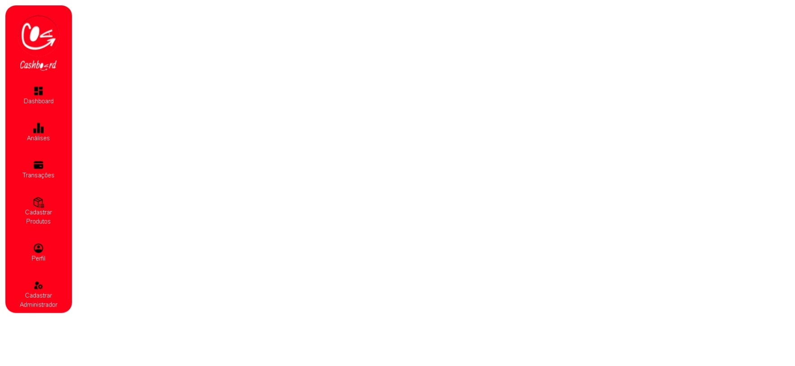
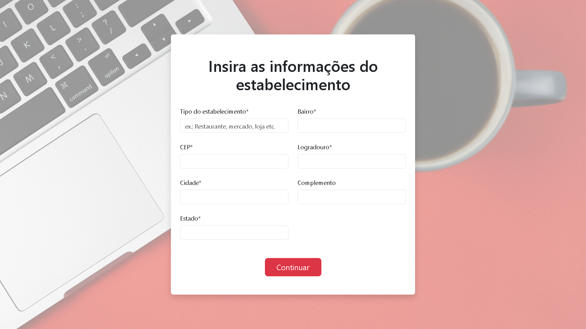
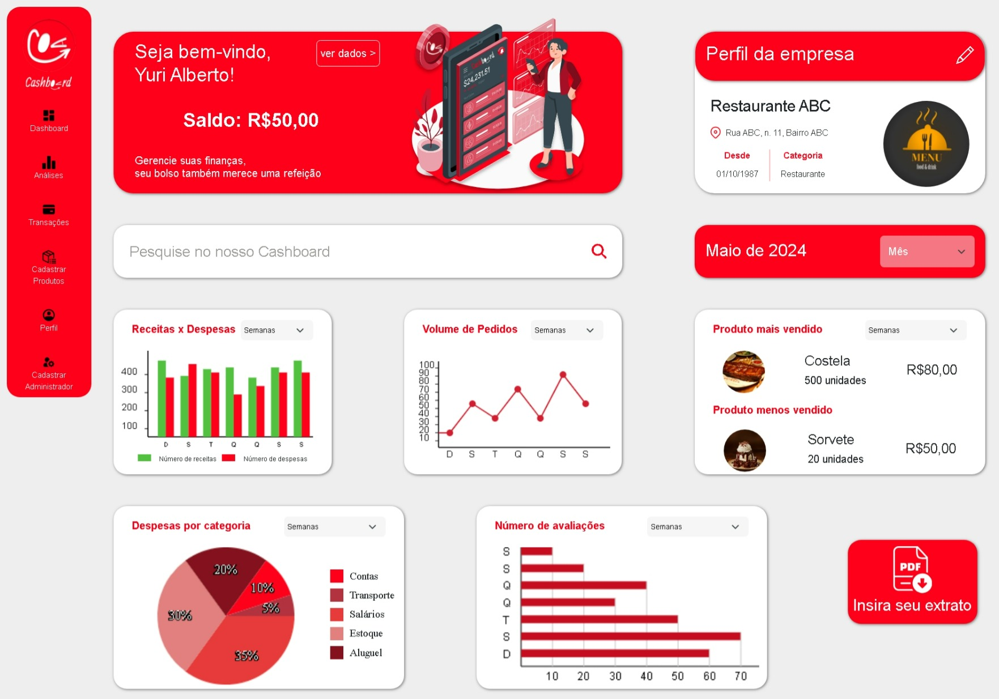
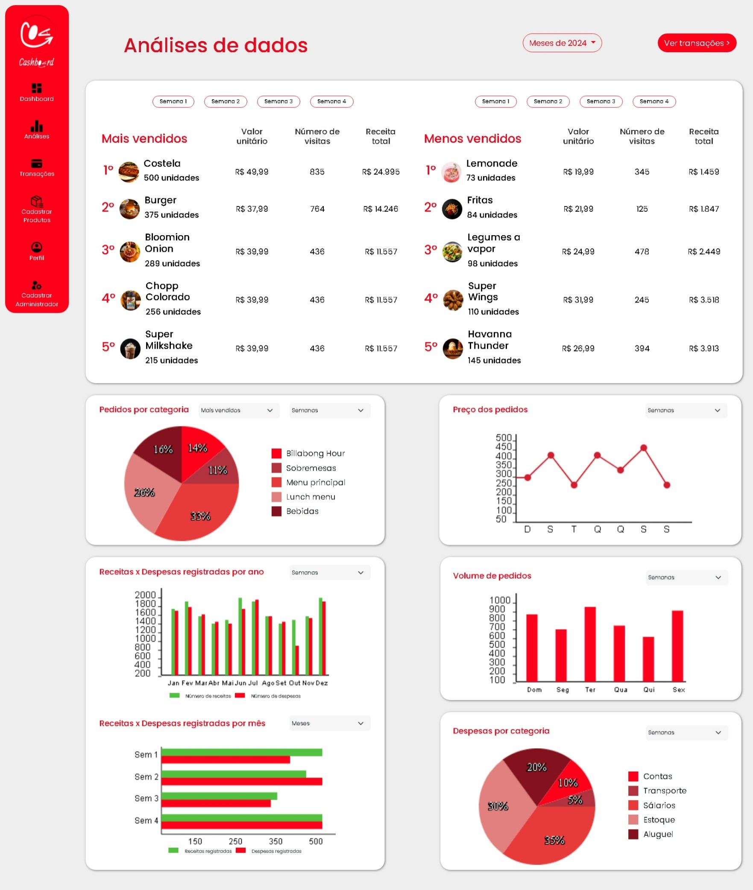
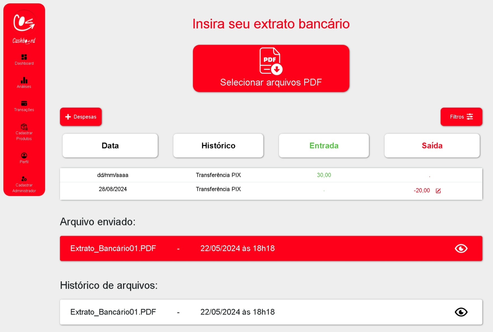
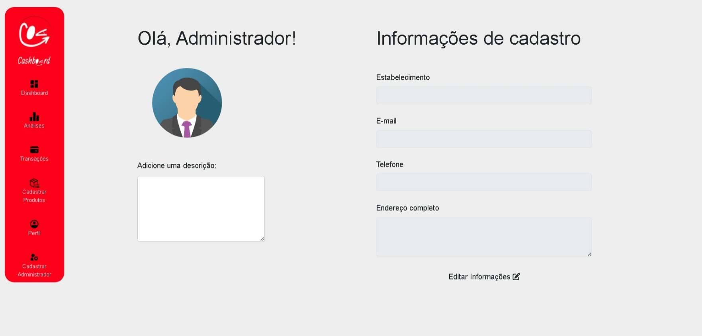
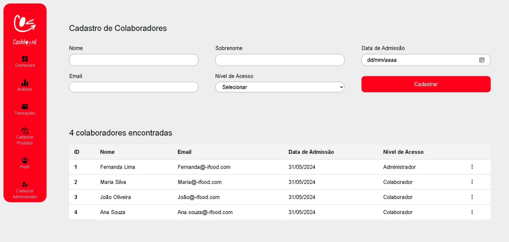

# IFOOD CASHBOARD - UMA APLICAÇÃO DE CONTROLE FINANCEIRO PARA SEU ESTABELECIMENTO ⚙️💸

## Sumário
1. Apresentação
2. Nav
    * 2.1. `nav.html`
    * 2.2. `nav.css`
    * 2.3. `nav.js`
3. Login
    * 3.1. `index.html`
    * 3.2. `login.css`
4. Cadastro de Empresa
    * 4.1. `cadastro-empresa.html`
    * 4.2. `cadastro-empresa.css`
5. Cadastro de Estabelecimento
    * 5.1. `cadastro-estabelecimento.html`
    * 5.2. `cadastro-estabelecimento.css`
6. Dashboard
    * 6.1. `dashboard.html`
    * 6.2. `dashboard.css`
    * 6.3. `dashboard.js`
7. Análises
    * 7.1. `analises.html`
    * 7.2. `analises.css`
    * 7.3. `analises.js`
8. Transações
    * 8.1. `transacoes.html`
    * 8.2. `transacoes.css`
    * 8.3. `transacoes.js`
9. Cadastro de Produtos
    * 9.1. `cadastro-produtos.html`
    * 9.2. `cadastro-produtos.css`
    * 9.3. `produto.js`
10. Perfil
    * 10.1. `perfil.html`
    * 10.2. `perfil.css`
    * 10.3. `perfil.js`
11. Cadastro de Administrador
    * 11.1. `cadastro-administrador.html`
    * 11.2. `cadastro-administrador.css`
    * 11.3. `administrador.js`

## 1. Apresentação 

🎉 **Bem-vindo ao Cashboard!** 🎉

O Cashboard é um sistema web completo para o controle financeiro do aplicativo iFood,  desenvolvido para auxiliar estabelecimentos na gestão de suas receitas e despesas.  📈💰

Com o Cashboard, você terá acesso a:

* **Dashboard:** Uma visão geral das suas finanças, com gráficos e indicadores chave para acompanhar seu desempenho. 📊
* **Análises:**  Relatórios detalhados com gráficos e tabelas para entender melhor suas receitas, despesas e produtos mais vendidos. 📈
* **Transações:**  Gerencie as entradas e saídas do seu negócio com um extrato completo e intuitivo. 📑
* **Cadastro de Produtos:**  Adicione seus produtos ao menu, com fotos, descrição e informações detalhadas. 🍔🍕
* **Cadastro de Estabelecimento:**  Cadastre seu estabelecimento com informações completas de endereço e contato. 📍
* **Cadastro de Administrador:**  Gerencie usuários e atribua diferentes níveis de acesso ao sistema. 🧑‍💼
* **Perfil:**  Acesse e edite as informações do seu perfil e do seu estabelecimento. 👤

**Recursos:**

* **HTML:**  O projeto utiliza HTML para elaborar o conteúdo presente nas telas. 
* **CSS:**  Foi utilizado o CSS para personalizar o conteúdo juntamento com o Bootstrap. 
* **Bootstrap:**  O projeto utiliza o framework Bootstrap para um layout responsivo e fácil de personalizar. 
* **Javascript:**   Funcionalidades dinâmicas para interação com o usuário, manipulação de dados e **criação de gráficos personalizados**.

**Objetivo:**  

O Cashboard visa oferecer aos restaurantes uma ferramenta poderosa e intuitiva para gerenciar seus negócios de forma eficiente, organizada e transparente, permitindo um melhor controle das finanças e um crescimento consistente. 

## 2. Nav 

A tela `nav` é a barra de navegação do sistema Cashboard,  responsável por oferecer acesso rápido e intuitivo às outras telas da aplicação. 🧭 

### 2.1. `nav.html`

O arquivo `nav.html` define a estrutura da barra de navegação, utilizando a tag `<header>` e `<ul>` para organizar os itens do menu. 

**Elementos principais:**

* **Logo:** Exibe a logo do Cashboard. 
* **Itens do menu:**  Lista os itens da navegação:
    * Dashboard
    * Análises
    * Transações
    * Cadastrar Produtos
    * Perfil
    * Cadastrar Administrador

**Destaques:**

* **Inclusão de arquivos CSS:**  O código inclui os arquivos CSS do Bootstrap, Bootstrap Icons e Font Awesome para a estilização e os ícones do menu.
* **Responsividade:** A tela `nav.html` foi preparada para se adaptar a diferentes tamanhos de tela, com o uso de `@media` no arquivo `nav.css`. 

### 2.2. `nav.css`

O arquivo `nav.css` define os estilos da barra de navegação, com o objetivo de torná-la visualmente atrativa e funcional. 🎨

**Pontos importantes:**

* **Estilos para o menu vertical:**  A tela `nav` é inicialmente exibida como um menu vertical, com a classe CSS `header` e as tags `ul`, `li` e `a`.
* **Estilos para o menu offcanvas:**  A tela `nav` é exibida como um menu horizontal (offcanvas) em telas menores, utilizando as classes CSS `esquerda` e `direita`.
* **Responsividade:**  O CSS utiliza `@media` para garantir que a navegação seja exibida de forma adequada em diferentes tamanhos de tela.

### 2.3. `nav.js`

O arquivo `nav.js`  é utilizado para carregar o conteúdo do arquivo `nav.html` dentro do  `nav-placeholder` da tela `perfil`. 

**Funcionalidade:**

* **Carregamento do conteúdo:**  O script usa `fetch` para buscar o conteúdo do arquivo `nav.html` e inserir dentro da tela `perfil`, usando `replaceChild` para substituir o `nav-placeholder` pelo conteúdo do menu.

## 3. Login 

A tela `login` é a porta de entrada para o sistema Cashboard.  Aqui, os usuários podem acessar suas contas com suas credenciais.  🔐

### 3.1. `index.html`

O arquivo `index.html` define a estrutura da tela de login,  com um formulário de autenticação e as logos do iFood e Cashboard. 

**Elementos principais:**

* **Título da tela:** "Portal Financeiro Cashboard"
* **Formulário de login:**
    * **Campos:**
        * Email
        * Senha 
    * **Links:**
        * "Esqueci minha senha"
        * "Cadastre seu estabelecimento"
    * **Botão:** "Entrar"
* **Logos:**
    * Logo do iFood
    * Miniatura do Cashboard

**Destaques:**

* **Layout responsivo:**  A tela foi construída com o framework Bootstrap para se adaptar a diferentes tamanhos de tela, usando classes CSS como `vh-100`, `d-flex`, `justify-content-center`, `align-items-center`, `flex-column`, `row`, `col-sm-8`, `col-md-6`, `col-lg-4`, `p-4`, `mt-auto`, `shadow`, `rounded` e `form-floating`. 
* **Utilização de imagens:**  A tela utiliza as imagens das logos do iFood e Cashboard. 

### 3.2. `login.css`

O arquivo `login.css`  define os estilos da tela,  utilizando as classes CSS do Bootstrap para a estilização do formulário, do botão "Entrar" e das logos. 

**Pontos importantes:**

* **Estilos para a tela:** O CSS define estilos para a tela, usando `background-image` para definir a imagem de fundo da tela, e `box-shadow` e `border-radius` para adicionar efeitos visuais aos elementos. 
* **Estilos para o formulário:**  O CSS define estilos para o título,  os campos do formulário,  o botão "Entrar"  e o container das logos,  utilizando as classes CSS do Bootstrap.
* **Responsividade:** O CSS utiliza `@media` para garantir que a tela seja exibida de forma adequada em diferentes tamanhos de tela. 

## 4. Cadastro de Empresa 

A tela `cadastro-empresa`  é a porta de entrada para novos restaurantes no sistema Cashboard,  permitindo que eles criem suas contas e comecem a usar a plataforma.  🏢

### 4.1. `cadastro-empresa.html`

O arquivo `cadastro-empresa.html`  define a estrutura da tela, com um formulário de cadastro de empresas,  e as logos do iFood e Cashboard.  

**Elementos principais:**

* **Título:**  "Insira as informações da sua empresa"
* **Formulário de cadastro:**
    * **Campos:**
        * CNPJ
        * Nome Fantasia
        * Email
        * Senha
        * Repita a senha
    * **Botão:** "Continuar"
* **Logos:**
    * Logo do iFood
    * Logo do Cashboard

**Destaques:**

* **Layout responsivo:**  A tela foi construída com o framework Bootstrap para se adaptar a diferentes tamanhos de tela, usando classes CSS como `vh-100`, `d-flex`, `justify-content-center`, `align-items-center`, `flex-column`, `row`, `col-sm-8`, `col-md-6`, `col-lg-4`, `p-4`, `mt-auto`, `shadow`, `rounded` e `form-floating`. 
* **Utilização de imagens:**  A tela utiliza as imagens das logos do iFood e Cashboard.

### 4.2. `cadastro-empresa.css`

O arquivo `cadastro-empresa.css`  define os estilos da tela, utilizando as classes CSS do Bootstrap para a estilização do formulário, do botão "Continuar" e das logos. 

**Pontos importantes:**

* **Estilos para a tela:** O CSS define estilos para a tela, usando `background-image` para definir a imagem de fundo da tela, e `box-shadow` e `border-radius` para adicionar efeitos visuais aos elementos. 
* **Estilos para o formulário:**  O CSS define estilos para o título,  os campos do formulário,  o botão "Continuar"  e o container das logos,  utilizando as classes CSS do Bootstrap.
* **Responsividade:** O CSS utiliza `@media` para garantir que a tela seja exibida de forma adequada em diferentes tamanhos de tela.

## 5. Cadastro de Estabelecimento 

A tela `cadastro-estabelecimento`  permite que os restaurantes completem o cadastro,  fornecendo informações importantes sobre seu estabelecimento, como endereço, tipo de negócio e outros detalhes. 📍🏢

### 5.1. `cadastro-estabelecimento.html`

O arquivo `cadastro-estabelecimento.html`  define a estrutura da tela, com um formulário de cadastro de estabelecimentos.  

**Elementos principais:**

* **Título:**  "Insira as informações do estabelecimento"
* **Formulário de cadastro:**
    * **Campos:**
        * Tipo do Estabelecimento
        * Bairro
        * CEP
        * Logradouro
        * Cidade
        * Estado
        * Complemento
    * **Botão:** "Continuar"

**Destaques:**

* **Layout responsivo:**  A tela foi construída com o framework Bootstrap para se adaptar a diferentes tamanhos de tela, usando classes CSS como `vh-100`, `d-flex`, `justify-content-center`, `align-items-center`, `flex-column`, `row`, `col-sm-10`, `col-md-8`, `col-lg-5`, `p-4`, `shadow`, `rounded`,  e `form-floating`. 
* **Organização em duas colunas:** O formulário é organizado em duas colunas (`col`) para facilitar a visualização e o preenchimento dos campos.

### 5.2. `cadastro-estabelecimento.css`

O arquivo `cadastro-estabelecimento.css`  define os estilos da tela, utilizando as classes CSS do Bootstrap para a estilização do formulário, do botão "Continuar"  e do container das logos. 

**Pontos importantes:**

* **Estilos para a tela:** O CSS define estilos para a tela, usando `background-image` para definir a imagem de fundo da tela, e `box-shadow` e `border-radius` para adicionar efeitos visuais aos elementos. 
* **Estilos para o formulário:**  O CSS define estilos para o título,  os campos do formulário,  o botão "Continuar"  e o container das logos,  utilizando as classes CSS do Bootstrap.
* **Responsividade:** O CSS utiliza `@media` para garantir que a tela seja exibida de forma adequada em diferentes tamanhos de tela.

## 6. Dashboard

A tela `dashboard`  é o painel de controle do Cashboard,  oferecendo uma visão geral e completa do desempenho do restaurante,  com gráficos e informações chave para ajudar a tomar decisões estratégicas.  📊📈

### 6.1. `dashboard.html`

O arquivo `dashboard.html` define a estrutura da tela, organizando as seções com os gráficos,  as informações do usuário e da empresa, e o botão para inserir o extrato bancário. 

**Elementos principais:**

* **Seção de Boas-vindas:**
    * **Título:** "Seja bem-vindo, [Nome do Usuário]!"
    * **Saldo:** Exibe o saldo atual do restaurante.
    * **Mensagem:** Uma mensagem de boas-vindas. 
    * **Botão:** "Ver dados" 
* **Seção de Perfil da Empresa:**
    * **Título:** "Perfil da empresa"
    * **Informações da empresa:** 
        * Nome do restaurante
        * Localização
        * Data de fundação
        * Categoria
* **Seção de Gráficos:** 
    * **Receitas x Despesas:**  Gráfico de colunas comparando as receitas e despesas do restaurante.
    * **Volume de Pedidos:**  Gráfico de linhas mostrando a variação do volume de pedidos.
    * **Produto mais vendido:** Exibe a imagem do produto mais vendido, o nome e a quantidade vendida.
    * **Produto menos vendido:**  Exibe a imagem do produto menos vendido, o nome e a quantidade vendida. 
    * **Despesas por categoria:** Gráfico de pizza mostrando a porcentagem de cada despesa em relação ao total.
    * **Número de avaliações:** Gráfico de barras horizontais mostrando o número de avaliações por dia da semana.
* **Seção de Extrato:**
    * **Botão:** "Insira seu extrato"

**Destaques:**

* **Inclusão de arquivos CSS:**  O código inclui os arquivos CSS do Bootstrap, Bootstrap Icons e Font Awesome para a estilização e os ícones do menu.
* **Dropdown para selecionar semanas e meses:**  Utiliza a tag `<select>` para permitir que o usuário escolha a semana ou o mês para análise.
* **Inclusão de arquivos JS:**  O código inclui o arquivo `dashboard.js`, que define o comportamento dos gráficos e a atualização do mês atual. 

### 6.2. `dashboard.css`

O arquivo `dashboard.css`  define os estilos da tela,  utilizando classes CSS do Bootstrap para a estilização das seções,  dos gráficos,  dos botões,  e dos elementos da legenda. 

**Pontos importantes:**

* **Estilos para a tela:**  O CSS define estilos para a tela, usando `box-shadow`, `border-radius`, e `background-size` para adicionar efeitos visuais aos elementos.
* **Estilos para as seções:** O CSS define estilos para as seções de boas-vindas, perfil da empresa e gráficos,  com cores e layouts específicos para cada seção.
* **Responsividade:**  O CSS utiliza `@media` para garantir que a tela seja exibida de forma adequada em diferentes tamanhos de tela. 
* **Efeitos de `hover`:** O CSS utiliza `:hover` para aplicar transições de cores nos botões,  melhorando a interatividade da tela.  

### 6.3. `dashboard.js`

O arquivo `dashboard.js` define o comportamento da tela `dashboard`,  utilizando Javascript para:

* **Atualizar o mês atual:**  Atualiza o mês atual exibido na tela dinamicamente,  usando o valor selecionado no dropdown.

## 7. Análises 

A tela `analises`  é  o centro de inteligência do Cashboard,  permitindo que os usuários explorem dados importantes sobre o desempenho do restaurante através de gráficos e tabelas interativas. 📊📈 

### 7.1. `analises.html` 

O arquivo `analises.html`  define a estrutura da tela `analises`,  organizando as seções com os gráficos e tabelas. 

**Elementos principais:**

* **Título da tela:**  "Análises de dados" 
* **Botões:** 
    * **"Meses de 2024":**  Permite selecionar um mês específico para análise.
    * **"Ver transações":**  Redireciona para a tela de transações.
* **Seções:**  
    * **Produtos mais e menos vendidos:**  Exibe tabelas com os produtos mais e menos vendidos, com informações sobre valor unitário, número de visitas e receita total.
    * **Pedidos por categoria:**  Apresenta um gráfico de pizza para visualizar a distribuição de pedidos por categoria.
    * **Preço dos pedidos:**  Exibe um gráfico de linhas para visualizar a variação do preço médio dos pedidos.
    * **Receitas x Despesas (por ano):**  Apresenta um gráfico de colunas para comparar receitas e despesas ao longo do ano.
    * **Receitas x Despesas (por mês):**  Apresenta um gráfico de barras horizontais para comparar receitas e despesas em cada mês.
    * **Volume de pedidos:**  Apresenta um gráfico de colunas para visualizar o volume de pedidos por dia da semana.
    * **Despesas por categoria:**  Apresenta um gráfico de pizza para visualizar a distribuição das despesas por categoria. **A legenda do gráfico é interativa, permitindo que o usuário clique em cada linha para visualizar uma modal com as despesas daquela categoria.**

**Destaques:**

* **Inclusão de arquivos CSS:**  O código inclui os arquivos CSS do Bootstrap, Bootstrap Icons e Font Awesome para a estilização e os ícones do menu.
* **Dropdown para selecionar semanas e meses:**  Utiliza a tag `<select>` para permitir que o usuário escolha a semana ou o mês para análise.
* **Inclusão de arquivos JS:**  O código inclui o arquivo `analises.js`, que define o comportamento das tabelas, gráficos da tela e a modal de despesas. 

### 7.2. `analises.css`

O arquivo `analises.css` define os estilos da tela `analises`,  com o objetivo de criar um design visualmente atrativo, organizado e responsivo. 🎨

**Pontos importantes:**

* **Estilos para a tela:** O CSS define estilos para o título, os botões, as seções, as tabelas, os gráficos e os elementos da legenda.
* **Responsividade:**  O CSS utiliza `@media` para garantir que a tela seja exibida de forma adequada em diferentes tamanhos de tela. 
* **Efeitos de `hover`:** O CSS utiliza `:hover` para aplicar transições de cores nos botões e gráficos,  melhorando a interatividade da tela. 

### 7.3. `analises.js`

O arquivo `analises.js` define o comportamento das tabelas, gráficos da tela `analises` e a modal de despesas,  usando Javascript para manipular os dados e atualizar o conteúdo dos gráficos.

**Funcionalidade:**

* **Gráficos de pizza:**   O código utiliza Javascript para criar os gráficos de pizza, utilizando as classes CSS `pizzaGrafico`, `legendaPizzaGrafico` e `legendaPizzaCor`.
* **Gráficos de linhas:**   O código utiliza Javascript para criar os gráficos de linhas, utilizando as classes CSS `linhaGrafico` e `linhaGraficoContainer`.
* **Gráficos de colunas:**   O código utiliza Javascript para criar os gráficos de colunas, utilizando as classes CSS `colunaGrafico`, `legendaColunaGrafico` e `legendaColunaCor`.
* **Gráficos de barras horizontais:**   O código utiliza Javascript para criar os gráficos de barras horizontais, utilizando as classes CSS `barraGrafico` e `barraGraficoContainer`.
* **Interatividade:** O Javascript define o comportamento do `hover` nos gráficos para exibir mais informações ao passar o mouse sobre as barras ou fatias do gráfico.
* **Modal de Despesas:**  O Javascript define o comportamento da modal,  configurando o conteúdo de acordo com a categoria selecionada na legenda do gráfico de pizza.

## 8. Transações 

A tela `transacoes`  é  a área onde o restaurante pode gerenciar seus extratos bancários,  adicionando novos extratos,  filtrando transações e  editando informações de despesas. 📑

### 8.1. `transacoes.html` 

O arquivo `transacoes.html`  define a estrutura da tela,  com um formulário para adicionar extratos,  botões para adicionar despesas e filtrar transações,  e a tabela de transações. 

**Elementos principais:**

* **Título:** "Insira seu extrato bancário"
* **Botão:** "Selecionar arquivos PDF" 
* **Botões:** 
    * **"Despesas":** Abre uma modal para adicionar despesas.
    * **"Filtros":** Abre uma modal para filtrar transações.
* **Tabela de Transações:**
    * **Colunas:**
        * Data
        * Histórico
        * Entrada
        * Saída (com botão para editar)
* **Modal de Despesas:**
    * **Título:** "Adicionar despesa" 
    * **Formulário:** 
        * Campos para adicionar uma nova despesa (tipo, valor, data, descrição)
    * **Botão:** "Inserir" 
* **Modal de Filtros:**
    * **Título:** "Filtros"
    * **Formulário:** 
        * Campos para filtrar transações (data início, data fim, valor início, valor fim)
    * **Botão:** "Consultar"
* **Modal de Edição de Despesas:**
    * **Título:** "Editar despesa" 
    * **Formulário:** 
        * Campos para editar as informações da despesa (data, valor, descrição)
    * **Botão:** "Inserir" 

**Destaques:**

* **Inclusão de arquivos CSS:**  O código inclui os arquivos CSS do Bootstrap, Bootstrap Icons e Font Awesome para a estilização e os ícones do menu.
* **Modal para adicionar despesas:** Utiliza um modal para permitir que o usuário adicione novas despesas, garantindo uma experiência mais organizada. 
* **Modal para filtrar transações:** Utiliza um modal para permitir que o usuário filtre as transações,  com campos para definir o intervalo de datas e valores.
* **Modal para editar despesas:** Utiliza um modal para permitir que o usuário edite as informações da despesa.
* **Botões de opções:** Utiliza um ícone da biblioteca Bootstrap Icons (`<i class="bi bi-pencil-square"></i>`) para abrir um menu dropdown com as opções "Editar" e "Excluir" em cada linha da tabela.
* **Inclusão de arquivos JS:**  O código inclui o arquivo `transacoes.js`, que define o comportamento do formulário, botões e modais. 

### 8.2. `transacoes.css`

O arquivo `transacoes.css`  define os estilos da tela,  utilizando classes CSS do Bootstrap para a estilização do formulário,  dos botões,  da tabela de transações,  e dos modais. 

**Pontos importantes:**

* **Estilos para a tela:**  O CSS define estilos para o título, os botões, as seções, as tabelas, os modais,  e a responsividade da tela. 
* **Responsividade:** O CSS utiliza `@media` para garantir que a tela seja exibida de forma adequada em diferentes tamanhos de tela.
* **Cores e efeitos visuais:**  O CSS define cores para os elementos da tela e utiliza `box-shadow` e `border-radius` para adicionar efeitos visuais. 

### 8.3. `transacoes.js`

O arquivo `transacoes.js`  define o comportamento da tela `transacoes`,  utilizando Javascript para:

* **Gerenciar a tabela de transações:**  Adiciona novas linhas na tabela de transações com base nos dados do formulário de despesas.
* **Atualizar o título da tabela:**  Atualiza o título da tabela dinamicamente,  exibindo o número de despesas encontradas.
* **Limpar o formulário após o submit:**  Limpa os campos do formulário após o envio dos dados.
* **Preencher os inputs do modal de edição:**  Preenche os campos do modal de edição de despesas com as informações da linha selecionada na tabela.

## 9. Cadastro de Produtos 

A tela `cadastro-produtos`  é a área onde os restaurantes podem adicionar, editar e gerenciar seus produtos, criando um cardápio completo e atrativo para os clientes. 🍔🍕

### 9.1. `cadastro-produtos.html`

O arquivo `cadastro-produtos.html` define a estrutura da tela, com um cardápio organizado em categorias,  e as janelas modais para adicionar, editar e excluir categorias e itens.

**Elementos principais:**

* **Título:** "Cardápio" 
* **Botões:**
    * **"Alterar ordem":** Abre uma modal para permitir que o usuário altere a ordem das categorias e itens do cardápio.
    * **"+ Categoria":** Abre uma modal para permitir que o usuário adicione uma nova categoria. 
* **Categorias:**
    * Exibe as categorias do cardápio:
        * "Menu Principal"
        * "Sobremesa"
        * "Bebidas" 
* **Itens:**
    * Exibe os itens de cada categoria, com informações sobre nome, descrição, status (ativo/inativo), valor e opções (editar e excluir).
* **Modais:**
    * **"Alterar Ordem":** Modal para reorganizar as categorias e itens do cardápio.
    * **"Adicionar Categoria":** Modal para inserir uma nova categoria.
    * **"Adicionar Item":** Modal para inserir um novo item.
    * **"Confirmação para categoria":** Modal de confirmação para exclusão de categorias.
    * **"Editar Item":** Modal para editar um item. 
    * **"Confirmação para item":** Modal de confirmação para exclusão de itens.

**Destaques:**

* **Inclusão de arquivos CSS:**  O código inclui os arquivos CSS do Bootstrap, Bootstrap Icons e Font Awesome para a estilização e os ícones do menu.
* **Utilização de  `data-bs-toggle="modal"`:**  É usado para abrir as janelas modais.
* **Utilização de `data-bs-target="#idModal"`:**  É usado para definir qual modal será aberta.
* **Inclusão de arquivos JS:**  O código inclui o arquivo `produto.js`, que define o comportamento das categorias, itens e modais.

### 9.2. `cadastro-produtos.css`

O arquivo `cadastro-produtos.css`  define os estilos da tela,  utilizando as classes CSS do Bootstrap para a estilização do cardápio, das janelas modais,  dos botões e dos ícones. 

**Pontos importantes:**

* **Estilos para a tela:**  O CSS define estilos para o título, os botões, as seções, as tabelas, os modais, os elementos de edição de cada item,  o ícone do tipo do item,  e a responsividade da tela. 
* **Responsividade:** O CSS utiliza `@media` para garantir que a tela seja exibida de forma adequada em diferentes tamanhos de tela.
* **Efeitos de `hover`:** O CSS utiliza `:hover` para aplicar transições de cores nos botões,  melhorando a interatividade da tela.  

### 9.3. `produto.js`

O arquivo `produto.js` define o comportamento das categorias, itens e modais da tela `cadastro-produtos`,  utilizando Javascript para:

* **Gerenciar a ordem do cardápio:**  Utiliza Javascript para manipular a ordem das categorias e itens do cardápio, permitindo que o usuário arraste e solte os elementos para reorganizá-los. 
* **Adicionar categorias:**  Escuta o evento `click` do botão "Adicionar Categoria"  para abrir a modal de cadastro de categorias.
* **Inserir categorias:**  Escuta o evento `click` do botão "Inserir" na modal de cadastro para inserir uma nova categoria.
* **Editar categorias:**  Escuta o evento `click` no ícone de edição de cada categoria para editar o nome da categoria.
* **Excluir categorias:**  Escuta o evento `click` no ícone de exclusão de cada categoria para abrir uma modal de confirmação e, se confirmado,  exclui a categoria. 
* **Adicionar itens:**  Escuta o evento `click` do botão "Adicionar Item" para abrir a modal de cadastro de itens. 
* **Inserir itens:**  Escuta o evento `click` do botão "Inserir" na modal de cadastro para inserir um novo item.
* **Editar itens:** Escuta o evento `click` no ícone de edição de cada item para abrir uma modal de edição. 
* **Excluir itens:**  Escuta o evento `click` no ícone de exclusão de cada item para abrir uma modal de confirmação e, se confirmado,  exclui o item.

## 10. Perfil

A tela `perfil`  é onde o usuário pode acessar e editar as informações pessoais e do seu estabelecimento,  mantendo seus dados sempre atualizados e seguros. 👤

### 10.1. `perfil.html`

O arquivo `perfil.html` define a estrutura da tela, organizando as seções com a foto de perfil,  a descrição,  e um formulário para editar as informações de cadastro. 

**Elementos principais:**

* **Título:** "Olá, Usuário!"
* **Seção de Informações do Usuário:** 
    * **Avatar:** Exibe a foto de perfil do usuário.
    * **Descrição:** Um campo de texto para o usuário adicionar uma descrição sobre si mesmo. 
* **Seção de Informações de Cadastro:**
    * **Título:** "Informações de cadastro" 
    * **Formulário de edição:**
        * **Campos:**
            * Estabelecimento
            * Email
            * Telefone
            * Endereço completo
    * **Botão:** "Editar Informações" 
* **Modal de Edição de Cadastro:**
    * **Título:** "Editar Informações de Cadastro"
    * **Formulário:** 
        * Campos para edição das informações de cadastro (tipo do estabelecimento, nome do estabelecimento, CEP, logradouro, telefone, bairro, cidade, estado, complemento, senha, confirmar senha)
    * **Botões:** "Cancelar" e "Concluir"

**Destaques:**

* **Inclusão de arquivos CSS:**  O código inclui os arquivos CSS do Bootstrap, Bootstrap Icons e Font Awesome para a estilização e os ícones do menu.
* **Modal para editar informações:** Utiliza um modal para permitir que o usuário edite as informações de cadastro, garantindo uma experiência mais organizada. 
* **Inclusão de arquivos JS:**  O código inclui o arquivo `perfil.js`, que define o comportamento do botão "Editar Informações" e a modal de edição. 

### 10.2. `perfil.css`

O arquivo `perfil.css`  define os estilos da tela,  utilizando classes CSS do Bootstrap para a estilização do avatar,  do formulário,  do botão "Editar Informações" e da modal de edição. 

**Pontos importantes:**

* **Estilos para a tela:** O CSS define estilos para a tela,  utilizando `box-shadow` e `border-radius` para adicionar efeitos visuais aos elementos.
* **Estilos para o avatar:** O CSS define estilos para o avatar,  utilizando a tag `
` com o id `avatar` para a estilização da imagem de perfil. 
* **Estilos para o formulário:**  O CSS define estilos para os campos do formulário,  o botão "Editar Informações"  e o container das logos,  utilizando as classes CSS do Bootstrap.
* **Responsividade:** O CSS utiliza `@media` para garantir que a tela seja exibida de forma adequada em diferentes tamanhos de tela. 

### 10.3. `perfil.js`

O arquivo `perfil.js` define o comportamento da tela `perfil`,  utilizando Javascript para:

* **Abrir a modal de edição de cadastro:** Escuta o evento `click` do botão "Editar Informações" para abrir a modal.
* **Salvar alterações no cadastro:** Escuta o evento `click` do botão "Concluir" na modal de edição para salvar as alterações no cadastro.

## 11. Cadastro de Administrador

A tela `cadastro-administrador`  é a porta de entrada para a gestão de usuários do sistema Cashboard,  permitindo que os restaurantes adicionem novos administradores com diferentes níveis de acesso. 🧑‍💼🔐

### 11.1. `cadastro-administrador.html`

O arquivo `cadastro-administrador.html` define a estrutura da tela, organizando o formulário de cadastro e a tabela que lista os administradores cadastrados. 

**Elementos principais:**

* **Título da tela:**  "Cadastro de Colaboradores"
* **Formulário de cadastro:**
    * **Campos:**
        * Nome
        * Sobrenome
        * Data de Admissão
        * Email
        * Nível de Acesso (Dropdown)
    * **Botão:** "Cadastrar"
* **Tabela de administradores:**
    * **Colunas:**
        * ID
        * Nome
        * Email
        * Data de Admissão
        * Nível de Acesso
        * Opções (Editar e Excluir)

**Destaques:**

* **Inclusão de arquivos CSS:**  O código inclui os arquivos CSS do Bootstrap, Bootstrap Icons e Font Awesome para a estilização e os ícones do menu.
* **Dropdown para selecionar nível de acesso:** Utiliza a tag `<select>` para permitir que o usuário escolha o nível de acesso.
* **Botões de opções:** Utiliza um ícone da biblioteca Bootstrap Icons (`<i class="bi bi-three-dots-vertical"></i>`) para abrir um menu dropdown com as opções "Editar" e "Excluir" em cada linha da tabela.
* **Inclusão de arquivos JS:**  O código inclui o arquivo `administrador.js`, que define o comportamento do formulário e da tabela. 

### 11.2. `cadastro-administrador.css`

O arquivo `cadastro-administrador.css`  define os estilos da tela,  utilizando classes CSS do Bootstrap para a estilização do formulário e da tabela. 

**Pontos importantes:**

* **Estilos para a tela:**  O CSS define estilos para o título, os campos do formulário, o botão "Cadastrar", o título da tabela,  as colunas da tabela e as linhas da tabela.
* **Responsividade:** O CSS utiliza `@media` para garantir que a tela seja exibida de forma adequada em diferentes tamanhos de tela. 
* **Cores e efeitos visuais:**  O CSS define cores para os elementos da tela e utiliza `box-shadow` e `border-radius` para adicionar efeitos visuais. 

### 11.3. `administrador.js`

O arquivo `administrador.js`  define o comportamento da tela `cadastro-administrador`,  utilizando Javascript para:

* **Adicionar novos administradores à tabela:** Escuta o evento `submit` do formulário para adicionar uma nova linha à tabela com as informações do administrador.
* **Atualizar o título da tabela:**  Atualiza o título da tabela dinamicamente,  exibindo o número de administradores encontrados.
* **Limpar o formulário após o submit:**  Limpa os campos do formulário após o envio dos dados.
